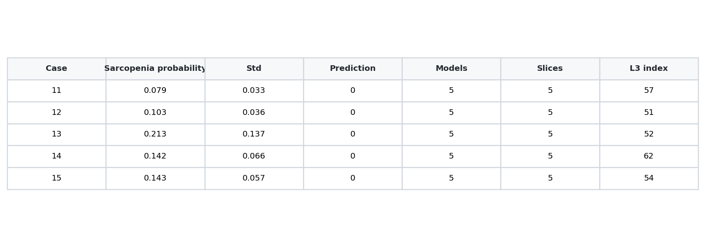
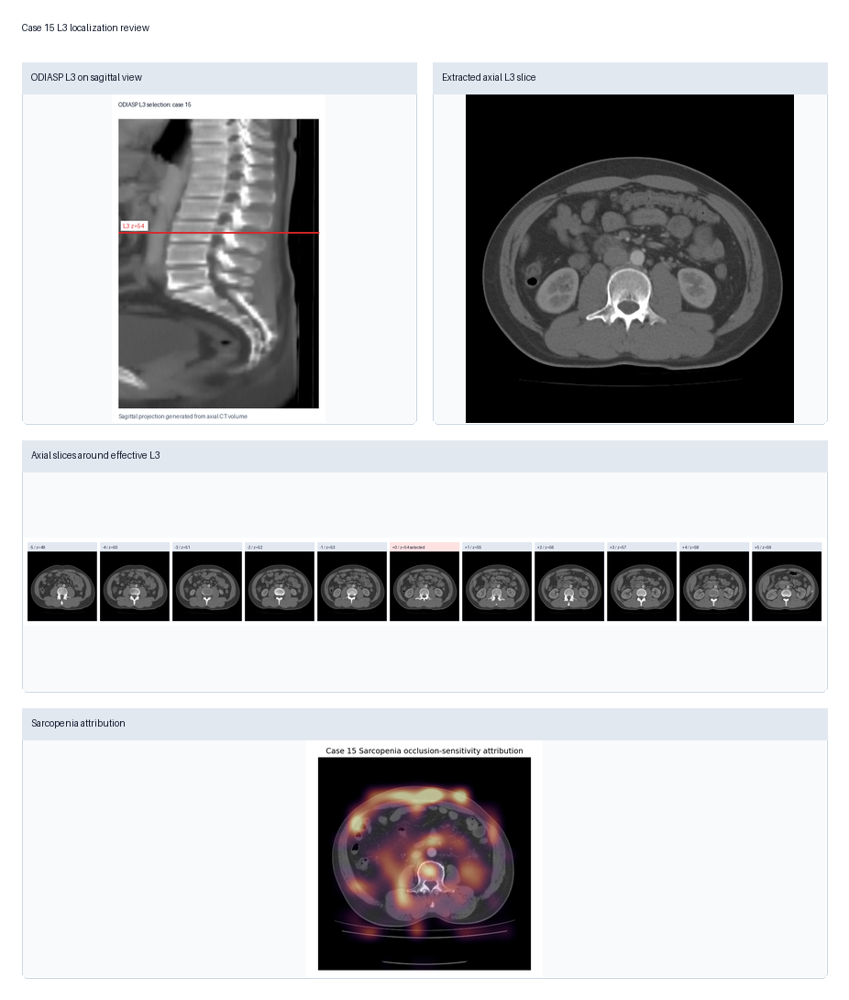
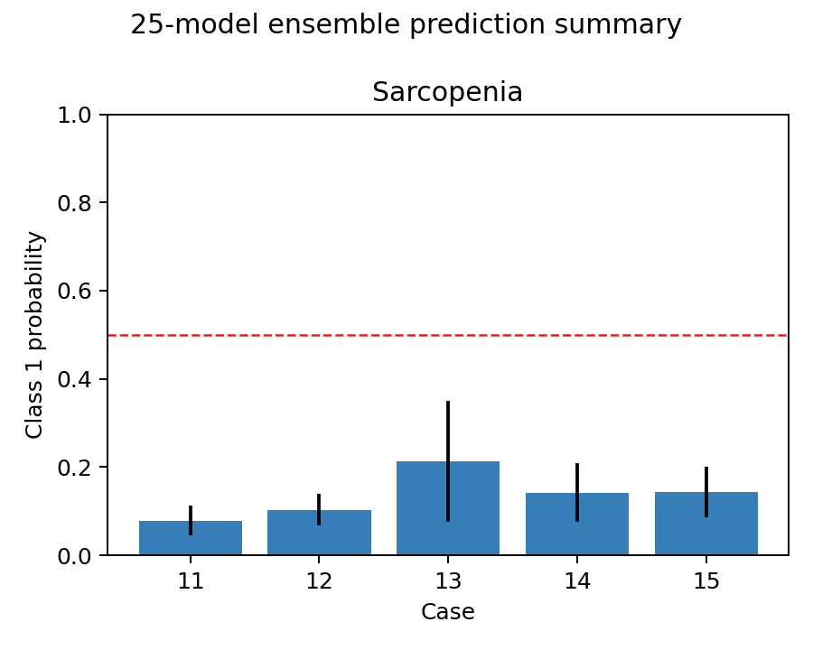

# L3 CT Sarcopenia Prediction

A Dockerized Gradio web application for research-use sarcopenia prediction from abdominal CT DICOM images and tabular clinical information.

The application localizes an L3 axial CT slice, runs a five-model TorchScript ensemble, and returns a sarcopenia probability with review figures, per-model outputs, and downloadable reports.

> Research use only. This repository is not a regulatory-approved medical device and must not be used for clinical diagnosis, treatment decisions, or patient management without independent validation and applicable regulatory review.

> Model release note: this Docker image uses five selected fold-best TorchScript models, named `model 1` through `model 5` in the web interface. It does not run the earlier full set of 25 candidate models.





## Project Background

Sarcopenia is commonly assessed from body-composition measurements around the third lumbar vertebra (L3). This project packages an inference workflow that combines:

- CT image processing and L3 slice selection
- Clinical features required by the trained model
- A five-model TorchScript ensemble
- Neighbor-slice averaging around the selected L3 slice
- Visual review outputs for L3 localization and image attribution

The goal is to make the trained model easier to evaluate in a reproducible environment: users can start the Docker container, open a browser page, upload a CT DICOM folder and a clinical spreadsheet, then download prediction results.

## What Is Included

Included in the Docker image:

- Gradio web interface
- Inference pipeline code
- Five selected fold-best TorchScript model files
- L3 localization runtimes

Included in this GitHub repository:

- Docker usage instructions
- Image-only Docker Compose file
- Clinical spreadsheet templates
- Example screenshots for documentation

Not included:

- Raw CT DICOM examples
- Clinical spreadsheets
- Patient identifiers or private test data
- TorchScript model files as standalone Git files; they are distributed inside the Docker image

## Docker Quick Start

Pull the image:

```bash
docker pull ghcr.io/docurdt/l3-ct-sarcopenia-prediction:latest
```

Run the web app:

```bash
docker run --rm -p 7860:7860 \
  -v "$(pwd)/outputs:/app/outputs" \
  ghcr.io/docurdt/l3-ct-sarcopenia-prediction:latest
```

Open:

```text
http://127.0.0.1:7860
```

On Windows PowerShell:

```powershell
docker run --rm -p 7860:7860 `
  -v "${PWD}\outputs:/app/outputs" `
  ghcr.io/docurdt/l3-ct-sarcopenia-prediction:latest
```

## Run With Docker Compose

```bash
docker compose up -d
```

The app will listen on:

```text
http://127.0.0.1:7860
```

## Web App Workflow

1. Open the Gradio page.
2. Select or upload the clinical Excel file.
3. Select or upload the CT DICOM folder.
4. Click `Load CT cases`.
5. Select one or more CT cases.
6. Choose the L3 localization backend.
7. Keep all five fold-best models selected for the standard ensemble prediction.
8. Click `Run Sarcopenia prediction`.
9. Review the tabbed outputs and download the result files.

The browser upload mode does not require users to mount their local CT folder into Docker. Gradio uploads the selected files into the container, stages them under the output directory, and runs inference there.

## Input 1: CT DICOM Folder

Recommended folder layout:

```text
CT_cases/
  11/
    *.dcm
  12/
    *.dcm
  13/
    *.dcm
```

Each case folder should contain one axial CT DICOM series. The case folder name should match the clinical spreadsheet case identifier.

For one case:

```text
CT_case_001/
  *.dcm
```

If browser upload does not preserve the original folder structure, the app tries to group DICOM files by `SeriesInstanceUID`. Series with too few slices are ignored.

## Input 2: Clinical Excel File

Use `.xlsx` or `.xls`.

Required clinical fields:

| Model field | Accepted English headers | Accepted Chinese headers | Notes |
|---|---|---|---|
| Case ID | `case_id`, `case id`, `case`, `id`, `patient_id`, `study_id` | `序号`, `编号`, `病例号` | Used to match CT folder names. |
| Height | `height`, `height_cm`, `height (cm)`, `height_m`, `height (m)` | `身高` | Centimeters or meters are accepted. Values greater than 3 are treated as centimeters. |
| BMI | `BMI`, `bmi` | `BMI` | Required by the model. |
| Sex | `sex`, `gender` | `性别` | Numeric values are accepted. Text values such as `male/female` and `男/女` are also accepted. |
| Age | `age` | `年龄` | Required by the model. |
| NRS | `NRS`, `nrs`, `nrs2002`, `NRS 2002 score` | `NRS` | Required by the model. |
| Hemoglobin | `hemoglobin`, `haemoglobin`, `hb`, `hgb` | `血红蛋白` | Required by the model. |

Optional fields:

| Optional field | Accepted English headers | Accepted Chinese headers | Notes |
|---|---|---|---|
| Weight | `weight`, `weight_kg`, `weight (kg)` | `体重` | Displayed in reports if present, but not used by the model. |
| Reference label | `sarcopenia`, `sarcopenia_label`, `label`, `target` | `肌少症` | Used only as an optional reference label in outputs. |

Minimal English example:

| case_id | height | weight | BMI | sex | age | NRS | hemoglobin | sarcopenia |
|---:|---:|---:|---:|---|---:|---:|---:|---:|
| 11 | 167 | 68 | 24.4 | male | 33 | 3 | 164 | 0 |

Minimal Chinese example:

| 序号 | 身高 | 体重 | BMI | 性别 | 年龄 | NRS | 血红蛋白 | 肌少症 |
|---:|---:|---:|---:|---:|---:|---:|---:|---:|
| 11 | 167 | 68 | 24.4 | 1 | 33 | 3 | 164 | 0 |

Privacy recommendation: remove direct identifiers such as name, medical record number, accession number, and institution before uploading data to any shared or remote deployment.

## Model Inputs Used Internally

The current TorchScript models receive:

- One selected L3 axial CT image tensor
- Six clinical features in this order:

```text
gender
height(m)
age
BMI
NRS 2002 score
hemoglobin
```

Neighbor-slice prediction can average predictions from `L3-k` through `L3+k`, depending on the selected radius.

## Outputs

The Gradio interface displays results in tabs:

- Final prediction: ensemble sarcopenia probability and binary prediction
- L3 and attribution review: selected L3 slice, sagittal/ODIASP review figure, neighbor-slice montage, and optional occlusion-sensitivity attribution
- Per-model prediction: each selected model and neighbor slice prediction
- Inference process: log of the processing steps

Generated files are written to:

```text
outputs/
```

Main output files:

```text
prediction_summary.csv
predictions_per_model.csv
report.html
manifest.json
figures/
```

Example ensemble figure:



## Output File Explanation

`prediction_summary.csv` contains one row per CT case and includes:

- `case_id`: matched CT case identifier
- `task`: sarcopenia prediction task
- `pred_label`: final predicted label
- `prob_class1_mean`: ensemble mean sarcopenia probability
- `prob_class1_std`: standard deviation across selected models/slices when available
- `num_models`: number of selected models used
- `num_prediction_slices`: number of neighbor slices used
- `auto_l3_index`: automatically selected L3 slice index
- `manual_l3_index`: manually overridden L3 slice index, if used
- `low_confidence`: whether L3 localization confidence was below the configured threshold
- `true_label`: optional reference label from the clinical spreadsheet, if provided

`predictions_per_model.csv` contains detailed model-level rows, including selected model name, neighbor-slice offset, slice index, class probabilities, and optional reference label.

`report.html` is a human-readable report with figures and tables.

`manifest.json` records structured metadata for downstream integration.

## Runtime Volume Option

For managed servers, you may mount data directories instead of using browser upload:

```yaml
services:
  l3-ct-gradio:
    volumes:
      - ./outputs:/app/outputs
      - /data/ct_cases:/data/ct_cases:ro
      - /data/clinical:/data/clinical:ro
```

Then enter these paths in the UI:

```text
/data/ct_cases
/data/clinical/clinical_data.xlsx
```

## API/Automation Notes

The Gradio app can be called programmatically after the container starts. For automated deployments, prefer mounting data into the container and passing container paths to the prediction endpoint, or use the web upload controls for interactive use.

The standard port is:

```text
7860
```

## Smoke Test

Without private test data:

```bash
bash deploy/docker_smoke_test.sh
```

With private local test data mounted outside the image:

```bash
docker compose -f docker-compose.yml -f docker-compose.private-test.yml up -d --build
bash deploy/docker_smoke_test.sh
```

## Image Distribution

Login to GitHub Container Registry with a GitHub Personal Access Token that has package write permission:

```bash
docker login ghcr.io
```

Build and push:

```bash
bash deploy/push_image.sh ghcr.io/docurdt/l3-ct-sarcopenia-prediction:latest
```

PowerShell:

```powershell
powershell -ExecutionPolicy Bypass -File .\deploy\push_image.ps1 `
  -Image ghcr.io/docurdt/l3-ct-sarcopenia-prediction:latest `
  -PushRetries 8
```

Verify:

```bash
docker manifest inspect ghcr.io/docurdt/l3-ct-sarcopenia-prediction:latest
```

## Privacy And Data Handling

Raw DICOM files and clinical spreadsheets may contain protected health information. They are intentionally excluded from the Docker image and deployment bundle.

The Docker build context excludes:

```text
CT_images/
clinical_data/
outputs/
l3_prediction_outputs*/
l3_upload*_test*/
```

Do not commit, publish, or bake raw patient data into the Docker image.

## Known Limitations

- L3 localization should be reviewed, especially when localization confidence is low.
- The attribution map is an occlusion-sensitivity approximation of image influence on the sarcopenia class. It should be interpreted as model behavior evidence, not anatomical ground truth.
- Performance and calibration must be validated independently before any clinical or translational use.
- External L3 locator components may have their own research/commercial-use license limitations. Review all included licenses before redistribution or deployment.
